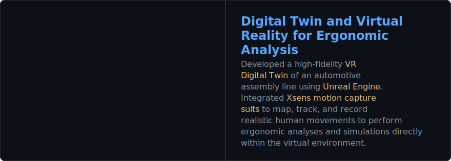

<!-- Typing SVG - https://github.com/DenverCoder1/readme-typing-svg -->

  

<!-- Social icons -->

  
  &#8287;&#8287;&#8287;&#8287;&#8287;
  

 

I enjoy building immersive 3D experiences, training ML models that understand visual data, and architecting robust software systems—from high-level mobile/web interfaces to low-level kernel routines.

### 🛠️ Core Technologies
*   **VR/AR, 3D & Digital Twins:** 
    
    
    
    
    
    

*   **Machine Learning & Vision:** 
    
    
    
    
    

*   **Systems & Embedded:** 
    
    
    
    

*   **Software Eng & Web:** 
    
    
    
    
    
    
    
    
    

  <!-- BEGIN PROJECT-CARDS -->
---

### 🎓 Master's Thesis

  

---

### 🚀 Highlighted Portfolio

#### 🥽 VR/AR & 3D Graphics
 

#### 🧠 Machine Learning & Computer Vision
 

#### 📱 Software Engineering & Web Architecture
 

#### ⚙️ Low-Level Systems
 
<!-- END PROJECT-CARDS -->

  <i>🚀 Want these dynamic portfolio cards on your profile? Get the GitHub Action at </i>

---
### 💡 Other Projects

* 📌 *Feel free to check out my pinned repositories to explore more projects I've developed, both individually and as part of a team.*

   
  <b>Check them out below!</b> 
  

